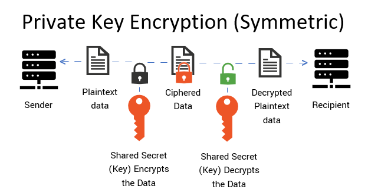
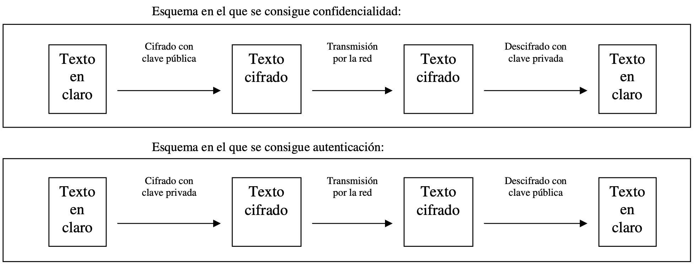

# Programación segura en Java

## **Seguridad en comunicaciones de datos**

En esta unidad de trabajo trabajaremos la seguridad de las comunicaciones de datos entre procesos. En particular, en los datos que un proceso emisor envía a otro proceso receptor para que lleguen inalterados, solo al receptor previsto, y que este tenga un modo de verificar que esto ha sido así. En caso de que los datos lleguen a algún otro destinatario, que éste no pueda entender la información codificada en dichos datos (que le resulten ininteligibles). Esto último se consigue encriptando o cifrando los datos.

### **Comunicaciones de datos**

En una comunicación de datos intervien dos partes: un **emisor** y un **receptor**.

La información que se quiere transmitir se codifica y se transmite de emisor a receptor por un **medio de comunicación**.

El medio de comunicación, normalmente, dista mucho de ser ideal. Los mensajes se pueden deteriorar y pueden no llegar a su destino. El medio suele ser compartido con otros emisores y receptores. Pueden tener acceso al medio usuarios no previstos o indeseables. Por lo tanto, el emisor no tiene seguridad total de que el mensaje llegue al receptor ni de que lo haga intacto. Y el receptor no tiene forma de asegurar que el mensaje proviene del supuesto emisor. **El medio es inseguro o no fiable**.

### **Aspectos de seguridad en las comunicaciones de datos**

Los aspectos fundamentales de la seguridad en las comunicaciones de datos son los siguientes:

* **Integridad**: los datos que recibe el receptor son idénticos a los que ha emitido el emisor. Es decir, que no se han alterado en algún punto intermedio. Se podrían deber a errores en el medio de comunicación o por la acción de alguien que quiere alterarlos.
* **Autenticación**: el receptor del mensaje puede estar seguro de que el emisor del mensaje es quien espera que sea. Es decir, que el emisor del mensaje es quien dice ser y no un suplantador.
* **Confidencialidad**: los datos transmitidos solo son inteligibles para el receptor previsto del mensaje. Por lo tanto, los datos deben ser inteligibles solo para el destinatario previsto. Esto se consigue enviando el mensaje encriptado, de forma que solo el destinatario previsto sea capaz de desencriptarlo.
* **No repudio**: el recpetor del mensaje puede demostrar, una vez recibido un mensaje de un emisor, que el mensaje fue emitido por dicho emisor.

Las mayores dificultades para ganantizar la seguridad en las comunicaciones entre procesos se plantean por el hecho de que estas se realizan a través de un canal no confiable. Es decir, no se puede restringir el acceso a dicho canal y por lo tanto cualquiera podría acceder a él para obtener una copia del mensaje o modificarlo/destruirlo.

<!--
## Seguridad en Java

* [JCA](https://docs.oracle.com/javase/8/docs/technotes/guides/security/crypto/CryptoSpec.html) (Java Chriptography Architecture) es una arquitectura que proporciona una API para:
  * Firma digital
  * HASH
  * Certificados digitales
  * Encriptación
  * Generación y gestión de claves
  * Generación de números aleatorios

* [JSSE](https://docs.oracle.com/javase/8/docs/technotes/guides/security/jsse/JSSERefGuide.html)
  * Soporte para SSL y TLS
  * Clases para crear canales seguros (SSLSocket, SSLServerSocket, SSLEngine)

* [JAAS](https://docs.oracle.com/javase/7/docs/technotes/guides/security/jaas/JAASRefGuide.html)
  * Autenticación
  * Autorización de usuarios para realizar determinadas acciones

# Criptografía con Java

JCA contiene una arquitectura basada en un conjunto de API para todo lo relacionado con criptografía de clave privada y pública. Es una arquitectura estándar de Java, parte del JDK, que proporciona un framework en el que se integran servicios criptográficos. Incluye paquetes como java.security, javax.crypto, javax.cripto.spec y javax.crypto.interfaces. Sus clases son:

* MessageDigest: para funcionas hash
* KeyGenerator: para generar y gestionar claves para criptografía simétrica
* KeyPairGenerator: para generar y gestionar pares de claves para criptografía asimétrica o de clave pública
* Cipher: para algoritmos de cifrado de datos
* Signature: para algoritmos de firma digital

-->

### Resúmenes de mensajes (funciones de hash o digest)

Una función de hash o digest hace corresponder a cada secuencia de bytes, por larga que sea, una cadena de longitud fija y, por lo general, relativamente corta. Este cálculo se realiza muy rápido. En cambio, es prácticamente imposible obtener una secuenca de bytes a la que corresponda un valor de hash determinado. Se dice que las funciones de hash son unidireccionales.

Un ejemplo de función hash lo tenemos en el algoritmo MD5, que a una secuencia de bytes de cualquier tamaño hace corresponder un valor de 128 bits.

En Linux podemos utilizar el comando `md5sum`, que genera una hash MD5 de un fichero o una string. Por ejemplo:

    root@sergio:/var/tmp# md5sum index.php
    8f63d2c8330c68cc4c88a9f9c57a81f5  index.php

Tenemos un  ejemplo de uso de este tipo de funciones resumen en la web de [descarga de la ISO Windows](https://www.microsoft.com/es-es/software-download/windows10ISO/) o en la de [Ubuntu](https://ubuntu.com/download/desktop/thank-you?version=22.04.1&architecture=amd64).

También podemos encontrar un ejemplo de funciones de hash en el **almacenamiento de contraseñas** en bases de datos. Por ejemplo, las de Moodle que veremos a continuación.

Las funciones hash son fundamentales en la firma digital, tal y como veremos más adelante.

<!--
Además de la ofuscación de contraseña, podemos encontrar otros ejemplos de uso en:

* Detectar ficheros idénticos en los gesores de archivos. Es mucho más sencillo comparar funciones hash que archivos completos.
* Verificación de la **integridad** en las comunicaciones de datos: 
* Firma digital: veremos su utilidad más adelante.

-->

Existen otras funciones de hash, además de MD5 (SHA-1, SHA-2, SHA3, por ejemplo). Todas ellas tienen varias propiedades importantes:

* **No reversibilidad**: debe ser prácticamente imposible obtener una secuencia para la que la función de hash calcule un valor determinado. Una de las aplicaciones de esta propiedad es la validación de contraseñas sin necesidad de almacenar su valor. En Linux lo podemos ver en el fichero "/etc/shadow"
* **Uniformidad**: el número de posibles secuencias es muy superior al número de posibles valores que puede tomar la función de hash.Cada posible valor de hash corresponderá, en general, a múltiples secuencias. La propiedad de uniformidad consiste en que cada valor de hash corresponde, aproximadamente, al mismo número de secuencias. Es decir, que no debe haber valores de hash sobrerepresentados que tengan notablemente más tendencia a salir como resultado de la función hash.
* **Discontinuidad**: pequeñas variaciones en la secuencia de bytes deberían dar como resultado grandes variaciones en el valor del hash calculado.

Estas propiedades de una función de hash hacen posible y viable su uso para verificar la **integridad** de un mensaje transmitido por un medio. Para ello, se adjunta al mensaje su valor de hash. En el destino se calcula el valor de hash sobre el mensaje recibido y se compara con el adjunto al mensaje. Si coinciden, se puede estar seguro de que el contenido del mensaje no se ha alterado desde su emisión.

Java contiene implementaciones para los principales algoritmos de hash o digest. Estos están disponibles mediante la clase MessageDigest.

Existen diferentes algoritmos de hash: MD5, SHA-1, SHA-2 y SHA-3. [MD5 y SHA-1 no se consideran seguros hoy en día](https://news.sophos.com/es-es/2017/01/27/algoritmo-md5-las-horas-contadas/) para criptografía. De los dos últimos hay variantes que generan hash de distintas longitudes.

Para generar un hash se procede de la siguiente forma:

* Se crea un objeto de la clase [MessageDigest](https://docs.oracle.com/javase/7/docs/api/java/security/MessageDigest.html) utilizando para ello el método estático `getInstance()` de la misma clase, especificando el nombre del aloritmo.
* Se añaden los datos a los cuales se les va a realizar el resumen, con el método `update()`, pasándole por parámetro la información en un array de tipo byte[]. Esto se puede hacer repetidamente para ir añadiendo nuevos datos.
* Se obtiene un array de bytes con el valor del hash invocando el método `digest()`.
* Para mostrar el hash por pantalla, recorremos el array de bytes anterior y convertimos cada posición a hexadecimal mediante `String.format("%02x", b)`

Por ejemplo, para la string "Esta es mi cadena" se generaría el hash SHA-2 "93dc0add70b99319fb15f474d852c1c2cb25096d80398a6407cae018bc834fd1". Podemos confirmar que el hash es correcto realizando la generación del resumen a través del sistema operativo. Por ejemplo, en Linux ejecutaríamos:

    sergio@sergio:~$ echo -n "Esta es mi cadena" | sha256sum 
    93dc0add70b99319fb15f474d852c1c2cb25096d80398a6407cae018bc834fd1

### Criptografía

Su objetivo es la escritura de mensajes de forma que sean ininteligibles excepto para el destinatario del mensaje. 

El funcionamiento de cualquier comunicación cifrada siempre se basa en un secreto compartido entre emisor y receptor, pero oculto para los demás. El método de cifrado puede ser secreto o no. En este último caso, sería necesario también conocer la clave para poder descifrarlo.

Un intento de descifrar un mensaje por parte de un emisor no previsto es un **ataque criptográfico**.

Por ejemplo, si utilizamos el método "desplazar letras" de forma que la clave sea el número de desplazamientos. Un ataque por fuerza bruta consistiría en probar todos los desplazamientos posibles.

Un **criptoanálisis** consiste en el análisis de métodos criptográficos y de mensajes cifrados para conseguir descifrar mensajes sin conocimiento previo de la información secreta usada para su cifrado.

La robustez de un método criptográfico viene dado por su resistencia frente a métodos de criptoanálisis y a ataques por fuerza bruta.

Para que un método se considere robusto no debe existir ningún tipo de criptoanálisis efectivo, ni si quiera para casos particulares.

La **encriptación o cifrado de la información** es el proceso por el cual la información o los datos a proteger son traducidos o codificados como algo que parece aleatorio y que no tiene ningún significado.

La **desencriptación** o descifrado es el proceso inverso, en el cual los datos encriptados son convertidos nuevamente a su forma original.

<!--
#### Generación y gestión de claves

Existen clases que permiten generar claves para los distintos algoritmos de clave privada y de clave pública. Las claves generadas por por estas clases satisfacen unos mínimos requisitos de calidad, sobre todo si se apoyan en buenos algoritmos de generación de números aleatorios.

El paquete *java.security* proporciona las siguientes clases para la gestión de las claves

* La interface `key`: permite la representación de claves, su almacenamiento y envío.
* La clase `KeyPairGenerator: permite la generación de claves públicas y privadas.
* La clase `KeyGenerator`: permite la generación de claves privadas.
* La clase `SecureRandom`: permite generar números aleatorios seguros.
  -->

#### Criptografía de clave privada (o simétrica)

La criptografía tradicional es de clave privada o simétrica. **La clave que se usa para cifrar un mensaje es la misma que se usa para descifrarlo**. Dicha clave es un secreto compartido entre emisor y receptor. 

<!-- Esto es poco práctico para aplicaciones tales como administración electrónica o comercio electrónico. No es viable que para hacer una compra en un sitio web de comercio electrónico sea necesario tener una clave privada compartida con la empresa que vende. -->

Son algoritmos muy rápidos y que no aumentan el tamaño del mensaje; por tanto adecuados para cifrar grandes volúmenes de datos.

Presentan el problema de la distribución de claves: el receptor debe conocer la clave que se va a utilizar, lo que implica que el emisor se la debe enviar y no es posible utilizar medios inseguros para el intercambio de claves.

Otro inconveniente es el gran número de claves que se necesitaría si el grupo de personas que puede comunicarse de forma privada es muy grande, pues se necesitaría una clave diferente cada dos personas del grupo.

La criptografía de clave privada puede utilizarse para garantizar:

* **Confidencialidad**: se supone que solo emisor y receptor conocen la clave. Solo el emisor puede desencriptar el mensaje.
* **Autenticación**: el receptor puede estar seguro de que solo el emisor ha podido generar el mensaje. Sin embargo, la criptografía de clave simétrica por sí sola no puede garantizarlo. Para ello requiere la ayuda de la criptografía de clave pública, como veremos más adelante.

La criptografía de clave privada no puede garantizar el no repudio. El emisor puede argumentar que un mensaje que está en poder del receptor no ha sido emitido por él mismo sino que ha sido creado por el receptor y no se le podría refutar. Ambos disponen de la misma clave para encriptar. Por esto mismo no es apropiado para la banca, administración electrónica o comercio electrónico.

Algoritmos de encriptación de clave privada:

* DES
* RC5
* 3DES
* AES
* Blowfish
* IDEA

Los algoritmos de cifrado y descifrado usan la misma clave.

El Java podemos realizar encriptación/desencriptación de clave simétrica utilizando la clase [`Cipher`](https://docs.oracle.com/javase/7/docs/api/javax/crypto/Cipher.html) de la siguiente forma:

* Mediante el método `getInstance()` se indica el algoritmo que se utilizará para cifrar (Por ejemplo "DES").
* Mediante el método `init()` se pasará por parámetro el modo de operación del objeto Cipher, por ejemplo encriptar(`ENCRYPT_MODE`) o desencriptar(`DECRYPT_MODE`) y la clave.
* Mediante el método `update()` se indicará el texto a cifrar y mediante `doFinal()` se generará el texto cifrado en forma de array de bytes.

La clave la generaremos previamente mediante la clase KeyGenerator de la siguiente forma:
* Invocamos al método `getInstance()` pasándole por parámetro el algoritmo para el que se va a utilizar la clave (por ejemplo, "DES"). Esto devolverá un objeto de la clase `KeyGen`.
* Especificamos la longitud, en bits, que tendrá la clave invocando al método `init()` de la clase `KeyGen`.
* Generamos la clave invocando al método `generateKey()`. La clave la almacenaremos en un objeto de la clase `SecretKey`.

<!--
La clase que vamos a utilizar para generar claves para algoritmos de clave privada será `SecretKeyGenerator`.

La generación de números aleatorios, como se indicó anteriormente, juega un papel muy importante en criptografía. Se pueden crear objetos de la clase `SecureRandom` que generen números aleatorios usando un algoritmo específico de entre todos los disponibles, indicado en el momento de su creación, y se pueden pasar a las clases generadoras de claves para que los utilicen, lo que puede redundar en una mejor calidad de las claves generadas. El adjetivo *secure* del nombre significa que el algoritmo utilizado es válido para la generación de números aleatorios para su uso en criptografía, porque genera secuencias de números que cumplen determinados requisitos de calidad. No es el caso, por ejemplo, de la clase Random.

##### Generación de claves para criptografía de clave privada 

La clave para criptografía de clave privada la generaremos utilizando la clase `SecretKeyGenerator` y posteriormente se almacenará en un fichero binario que solo contendrá dicha clave. 

El algoritmo de clave privada que utilizaremos será "triple DES".

El procedimiento a seguir para genera la clave será:

* Generar un objeto `KeyGenerator`: a través del método `getInstance()`de la clase `KeyGenerator`. Dicho método acepta como parámetro una string que representa el algoritmo para el cuál se va a utilizar la clave.
  
      KeyGenerator keyGen = KeyGenerator.getInstance("DES");

* Crear un objeto `SecureRandom`: La clase `SecureRandom` del paquete `java.Security` proporciona un potente generador de números aleatorios

      SecureRandom secRandom = new SecureRandom();

* Inicializar el objeto `KeyGenerator`: La clase `KeyGenerator`proporciona un método llamado `init()` que acepta un objeto `SecureRandom`e inicializa el objeto `KeyGenerator`.

      keyGen.init(secRandom);

* Generar la clave mediante el método `generateKey()`del objeto `KeyGenerator`. Dicho método devuelve un objeto de la clase `Key`que contendrá la clave generada.

      Key clave = keyGen.generateKey();

* Después:

      SecretKeyFactory keySpecFactory = SecretKeyFactory.getInstance("DES");
      DESedeKeySpec keySpec = (DESedeKeySpec) keySpecFactory.getKeySpec(clave, DESedeKeySpec.class);

##### Cifrado/descifrado con criptografía de clave privada
-->

#### Criptografía de clave pública (o asimétrica)

Permite el intercambio seguro de información **garantizando confidencialidad, autenticación y no repudio** entre interlocutores que **no comparten ningún secreto**. 

Se basa en la existencia de **un par de claves, una pública y otra privada**, entre las cuales existe una relación matemática, de manera que es muy difícil obtener la clave privada a partir de la pública. Por otra parte, es muy sencillo obtener la clave pública a partir de la privada. 

Cada pareja de claves, son complementarias: lo que cifra una de ellas, solo puede ser descifrado por su inversa. 

Al cifrar un mensaje con la clave pública, tan solo podrá descifrarlo quien posea la clave privada inversa a esa clave pública.

Cifrar un mensaje con la clave privada equivale a demostrar la autoría del mensaje, autenticación, nadie más ha podido cifrarlo utilizando esa clave privada. El mensaje cifrado con una clave privada podrá descifrarlo todo aquel que conozca la clave pública inversa. Por tanto, si A enviase un mensaje cifrado con su clave privada, podrá descifrarlo todo el que conozca la clave pública de A y además sabrá que el mensaje proviene de A. 

Son más lentos que los algoritmos simétricos.

Algoritmos criptográficos de clave pública:

* RSA
* ECC
* DSA

### Firma digital

Son el equivalente digital de las firmas personales. Se basan en criptografía de clave pública y resumen de mensajes o funciones HASH.

  * Para la transmisión de un mensaje entre un emisor y un receptor, el emisor transmitirá, junto con el texto deseado, la firma digital del mensaje cuya finalidad es comprobar la **integridad** del mensaje y la **autenticidad** del emisor.
  * Para ello, el emisor debe disponer de una clave pública y otra privada. Cuando desee enviar un mensaje a un receptor, codificará el mensaje con una función HASH cuya salida la cifrará con su clave privada, generando así la firma digital que transmitirá al receptor junto con el texto deseado. El receptor, separará el mensaje recibido en dos partes: el texto y la firma. Usará la clave pública del emisor para descifrar la firma y, al texto que recibe le aplicará la misma función HASH que el emisor, comparando la salida de su función con el mensaje descifrado incluido en la firma. Si coinciden, quedará probada la integridad del mensaje y la autenticidad del emisor.

La clase [Signature](https://docs.oracle.com/javase/7/docs/api/java/security/Signature.html) del paquete `java.security` permite realizar una firma digital, así como hacer su verificación.

Los pasos que debes seguir para realizar la firma de un mensaje y después verificarla son los siguientes:

* Generar las claves públicas y privadas mediante la clase [KeyPairGenerator](https://docs.oracle.com/javase/8/docs/api/java/security/KeyPairGenerator.html):
  * La `PrivateKey` la utilizaremos para firmar.
  * La `PublicKey` la utilizaremos para verificar la firma.
* Realizar la firma digital mediante la clase `Signature` y un algoritmo asimétrico, por ejemplo "DSA". (Esto lo haría el emisor)
  * Crearemos un objeto `Signature`.
  * Al método `initSign()` le pasamos la clave privada.
  * El método `update()` creará el resumen de mensaje a partir de los datos que le pasaremos por parámetro en formato byte[].
  * El método `sign()` devolverá la firma digital en formato byte[].
* Verificar la firma creada mediante la clave pública generada. (Esto lo haría el receptor tras recibir el mensaje y la firma)
  * Creamos un objeto `Signature`.
  * Al método `initVerify()` le pasaremos la clave pública del emisor.
  * Mediante `update()` generamos el resumen de mensaje pasándole por parámetro el texto recibido.
   * El método `verify()` realizará la verificación de la firma. Para ello le pasaremos por parámetro el texto firmado recibido.

<!-- EL algoritmo de firma digital DSA viene implementado en el JDK de SUN, es parte del estándar de firmas digitales DSS y con él se pueden utilizar los algoritmos de resumen MD5 y SHA-1 -->

<!-- ##### Generación de claves para criptografía de clave pública 

##### Cifrado/descifrado con criptografía de clave pública

## Generación y uso de certificados digitales

## Generación y uso de la firma digital

## Comunicaciones seguras con Java: JSSE -->
