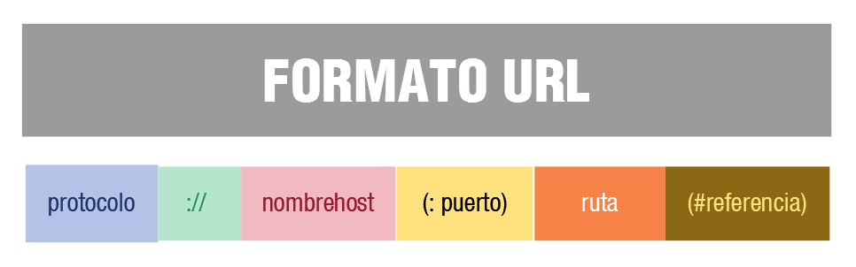

# Programación de servicios en red
Un servicio en red es un software o programa que proporciona una determinada funcionalidad o utilidad al sistema. Por lo general, estos programas están basados en un conjunto de protocolos y estándares.

Una clasificación de los servicios en red atendiendo a su finalidad o propósito puede ser la siguiente:

* **Administración/Configuración**. Esta clase de servicios facilita la administración y gestión de las configuraciones de los distintos equipos de la red, por ejemplo: los servicios DHCP y DNS.
* **Acceso y control remoto**. Los servicios de acceso y control remoto, se encargan de permitir la conexión de usuarios a la red desde lugares remotos, verificando su identidad y controlando su acceso, por ejemplo Telnet y SSH.
* **De ficheros**. Los servicios de ficheros consisten en ofrecer a la red grandes capacidades de almacenamiento para descongestionar o eliminar los discos de las estaciones de trabajo, permitiendo tanto el almacenamiento como la transferencia de ficheros, por ejemplo FTP.
* **Impresión**. Permite compartir de forma remota impresoras de alta calidad, capacidad y coste entre múltiples usuarios, reduciendo así el gasto.
* **Información**. Los servicios de información pueden servir ficheros en función de sus contenidos, como pueden ser los documentos de hipertexto, por ejemplo HTTP, o bien, pueden servir información para ser procesada por las aplicaciones, como es el caso de los servidores de bases de datos.
* **Comunicación**. Permiten la comunicación entre los usuarios a través de mensajes escritos, por ejemplo email o correo electrónico mediante el protocolo SMTP.

A veces un servicio toma como nombre el nombre del protocolo del nivel de aplicación en el que está basado. Por ejemplo, hablamos de servicio FTP, por basarse en el protocolo FTP.

En esta unidad de trabajo programaremos en Java algunos de estos servicios (servidores y clientes).

## Bibliotecas de clases y componentes Java
Java se ha construido con extensas capacidades de interconexión TCP/IP y soporta diferentes niveles de conectividad en red, facilitando la creación de aplicaciones cliente/servidor y generación de servicios en red.

El paquete principal que proporciona el API de Java para programar aplicaciones con comunicaciones en red es **java.net**. Este paquete soporta clases para generar diferentes servicios de red, servidores y clientes.

Para ciertos servicios estándar, Java no proporciona objetos predefinidos y por tanto una solución fácil para generarlos es recurrir a bibliotecas externas, como por ejemplo, el API proporcionado por Apache Commons Net (las bibliotecas [org.apache.commons.net](http://commons.apache.org/net/)).

### java.net
El paquete java.net, proporciona una API que se puede dividir en dos niveles:

* Una API de **bajo nivel**, que permite representar los siguientes objetos:
  * Direcciones IP.
    * Clase **InetAddress**. Implementa una dirección IP.
  * Sockets. Son los mecanismos básicos de comunicación bidireccional de datos.
    * Clase **Socket**. Implementa un extremo de una conexión bidireccional.
    * Clase **ServerSocket**. Implementa un socket que los servidores pueden utilizar para escuchar y aceptar peticiones de clientes.
    * Clase **DatagramSocket**. Implementa un socket para el envío y recepción de datagramas.
    * Clase **MulticastSocket**. Representa un socket datagrama, útil para enviar paquetes multidifusión.
  * Interfaces. Describen las interfaces de red.
    * Clase **NetworkInterface**. Representa una interfaz de red compuesta por un nombre y una lista de direcciones IP asignadas a esta interfaz.

* Una API de **alto nivel**, que se ocupa de representar los siguientes objetos, mediante las siguientes clases:
  * **URL**. Representan localizadores de recursos universales.
    * Clase URL. Representa una dirección URL.
  * Conexiones. Representa las conexiones con el recurso apuntado por URL.
    * Clase **URLConnection**. Es la superclase de todas las clases que representan un enlace de comunicaciones entre la aplicación y una URL.
    * Clase **HttpURLConnection**. Representa una URLConnection con soporte para HTTP y con ciertas caracteríaticas especiales.

### La clase InetAddress
La clase InetAddress proporciona objetos que puedes utilizar para manipular tanto direcciones IP como nombres de dominio. También proporciona métodos para resolver los nombres de host a sus direcciones IP y viceversa.

Una instancia de InetAddress consta de una dirección IP y en algunos casos también del nombre de host asociado. Esto último depende de si se ha creado con el nombre de host o bien ya se ha aplicado la resolución de nombres.

Esta clase no tiene constructores. Sin embargo, InetAddress dispone de métodos estáticos que devuelven objetos InetAddress. Te indicamos cuáles son esos métodos:

* **getLocalHost()**. Devuelve un objeto de tipo InetAddress con los datos de direccionamiento de mi equipo en la red local (no del conocido localhost).
* **getByName(String host)**. Devuelve un objeto de tipo InetAddress con los datos de direccionamiento del host que le pasamos como parámetro. Donde el parámetro host tiene que ser un nombre o IP válido, ya sea de Internet (como iesalandalus.org o 195.78.228.161), o de tu red de área local (como documentos.servidor o 192.168.0.5). Incluso puedes poner localhost, o cualquier otra IP o nombre NetBIOS de tu red local.
* **getAllByName(String host)**. Devuelve un array de objetos de tipo InetAddress con los datos de direccionamiento del host pasado como parámetro. Recuerda que en Internet es frecuente que un mismo dominio tenga a su disposición más de una IP.

Algunos métodos interesantes de un objeto InetAddress para resolver nombres son los siguientes:

* **getHostAddress()**. Devuelve en una cadena de texto la correspondiente IP.
getAddress(). Devuelve un array formado por los grupos de bytes de la IP correspondiente.
Otros métodos interesantes de esta clase son:

* **getHostName()**. Devuelve en una cadena de texto el nombre del host.
isReachable(int tiempo). Devuelve TRUE o FALSE dependiendo de si la dirección es alcanzable en el tiempo indicado en el parámetro.

[Código de ejemplo](./files/EjemploInetAddress.java)

### La clase URL
Una URL representa una dirección a un recurso web. Un recurso puede ser algo tan simple como un archivo o un directorio, o puede ser una referencia a un objeto más complicado, como una consulta a una base de datos, el resultado de la ejecución de un programa, etc.

La clase URL de Java permite representar un URL.

Utilizando la clase URL, se puede establecer una conexión con cualquier recurso que se encuentre en Internet, o en nuestra Intranet. Una vez establecida la conexión, invocando los métodos apropiados sobre ese objeto URL se puede obtener el contenido del recurso en el cliente.

¿Cómo podemos crear objetos URL? La clase URL dispone de diversos constructores para crear objetos tipo URL que se diferencian en la forma de pasarle la dirección URL. Por ejemplo, se puede crear un objeto URL:

* A partir de todos o algunos de los elementos que forman parte de una URL, como por ejemplo:
URL url=new URL("http", "www.ieselrincon.org","80","index.htm"). Crea un objeto URL a partir de los componentes indicados (protocolo, host, puerto, fichero), esto es, crea la URL: http://www.ieselrincon.org:80/index.htm.
* A partir de la cadena especificada, dejando que el sistema utilice todos los valores por defecto que tiene definidos, como por ejemplo: URL url=new URL("http://www.ieselrincon.org") que crearía la URL : http://www.ieselrincon.org.

Las URL son objetos de una sola escritura. Es decir, una vez que se ha creado un objeto URL no se puede cambiar ninguno de sus atributos (protocolo, nombre del host, nombre del fichero ni número de puerto).

Se puede analizar y descomponer una URL utilizando los siguientes métodos:

* getProtocol(). Obtiene el protocolo de la URL.
* getHost(). Obtiene el host de la URL.
* getPort(). Obtiene el puerto de la URL, si no se ha especificado obtiene -1.
* getDefaultPort(). Obtiene el puerto por defecto asociado a la URL, si no lo tiene obtiene -1.
* getFile(). Obtiene el fichero de la URL o una cadena vacía si no existe.
* getRef(). Obtiene la referencia de la URL o null si no la tiene.

[Código de ejemplo](./files/EjemploURL.java)

### La clase URLConnection
Un objeto URLConnection se puede utilizar para leer desde y escribir hacia el recurso al que hace referencia el objeto URL.

De entre los muchos métodos que nos permiten trabajar con conexiones URL vamos a centrarnos en primer lugar en los siguientes:

* **URL.openConnection()**. Devuelve un objeto URLConnection que representa una nueva conexión con el recurso remoto al que se refiere la URL.
* **URL.openStream()**. Abre una conexión a esta dirección URL y devuelve un InputStream para la lectura de esa conexión. Es una abreviatura de: openConnection(). getInputStream ().
  
Los pasos a seguir para leer la URL son:

* Crear el objeto URL mediante URL `url = new URL(...);`
* Obtener una conexión con el recurso especificado mediante `URL.openConnection()`.
* Abrir conexión con esa URL mediante `URL.openStream()`.
* Manejar los flujos necesarios para realizar la lectura

Por ejemplo, podemos utilizar objetos URL para leer un archivo de texto y almacenarlo en un fichero local, tal y como se muestra en el siguiente ejemplo:

[Código de ejemplo](./files/EjemploDescargaURL.java)

## Protocolos de comunicaciones del nivel de aplicación
Dentro de la jerarquía de protocolos TCP/IP, la capa de aplicación ocupa el nivel superior y es precisamente la que incluye los protocolos de alto nivel relacionados con los servicios en red.

La capa de Aplicación define los protocolos (normas y reglas) que utilizan las aplicaciones para intercambiar datos. 

A continuación, vamos a destacar algunos de los protocolos estándar del nivel de aplicación:

* **FTP**. Protocolo para la transferencia de ficheros.
* **Telnet**. Protocolo que permite acceder a máquinas remotas a través de una red. Permite manejar por completo la computadora remota mediante un intérprete de comandos.
* **SMTP**. Protocolo que permite transferir correo electrónico. Recurre al protocolo de oficina postal POP para almacenar mensajes en los servidores, en sus versiones POP2 (dependiente de SMTP para el envío de mensajes) y POP3/IMAP (independiente de SMTP).
* **HTTP**. Protocolo de transferencia de hipertexto.
* **SSH**. Protocolo que permite gestionar remotamente a otra compuatora de la red de forma segura.
* **DNS**. Protocolo para traducir direcciones de red.

### FTP

El protocolo FTP o Protocolo de Transferencia de Archivos proporciona un mecanismo estándar de transferencia de archivos entre sistemas a través de redes TCP/IP.

Las principales prestaciones de un servicio basado en el protocolo FTP o servicio FTP son las siguientes:

* Permite el intercambio de archivos entre máquinas remotas a través de la red.
* Consigue una conexión y una transferencia de datos muy rápidas.
  
Sin embargo, el servicio FTP adolece de una importante deficiencia en cuanto a seguridad: La información y contraseñas se transmiten en texto plano. Esto está diseñado así, para conseguir una mayor velocidad de transferencia. Al realizar la transmisión en texto plano, un posible atacante puede capturar este tráfico, acceder al servidor y/o apropiarse de los archivos transferidos.

Este problema de seguridad se puede solucionar mediante la encriptación de todo el tráfico de información, a través del protocolo no estándar SFTP usando SSH.

¿Cómo funciona el servicio FTP? Es una servicio basado en una arquitectura cliente/servidor y, como tal, seguirá las pautas generales de funcionamiento de este modelo, en ese caso:

* El servidor proporciona su servicio a través de dos puertos:
  * El puerto 20, para transferencia de datos.
  * El puerto 21, para transferencia de órdenes de control, como conexión y desconexión.
* El cliente se conecta al servidor haciendo uso de un puerto local mayor de 1024 y tomando como puerto destino del servidor el 21.

Las principales características del servicio FTP son las siguientes:

La conexión de un usuario remoto al servidor FTP puede hacerse como: usuario del sistema (debe tener una cuenta de acceso), usuario genérico (utiliza la cuenta anonymous, esto es, usuario anónimo), usuario virtual (no requiere una cuenta local del sistema.

El acceso al sistema de archivos es más o menos limitado, según el tipo de usuario qe se conecte y sus privilegios. Por ejemplo, el usuario anónimo solo tendrá acceso al directorio público que establece el administrador por defecto.

El servicio FTP soporta dos modos de conexión: modo activo y modo pasivo.
* **Modo activo**. Es la forma nativa de funcionamiento.
Se establecen dos conexiones distintas: la petición de transferencia por parte del cliente y la atención a dicha petición, iniciada por el servidor. De manera que, si el cliente está protegido con un cortafuegos, deberá configurarlo para que permita esta petición de conexión entrante a través de un puerto que, normalmente, está cerrado por motivos de seguridad.
* **Modo pasivo**. El cliente sigue iniciando la conexión, pero el problema del cortafuegos se traslada al servidor.

## Programación de aplicaciones cliente

### Cliente FTP

Java no dispone de bibliotecas específicas para programar clientes y servidores de FTP. Pero afortunadamente, la organización de software libre The Apache software Foundation proporciona una API para implementar clientes FTP en tus aplicaciones.

El paquete de la API de Apache para trabajar con FTP es org.apache.commons.net.ftp. Este paquete proporciona, entre otras, las siguientes clases:

* Clase **FTP**. Proporciona las funcionalidades básicas para implementar un cliente FTP. Esta clase hereda de SocketClient.
* Clase **FTPReplay**. Permite almacenar los valores devueltos por el servidor como código de respuesta a las peticiones del cliente.
* Clase **FTPClient**. Encapsula toda la funcionalidad que necesitamos para almacenar y recuperar archivos de un servidor FTP, encargándose de todos los detalles de bajo nivel para su interacción con el servidor. Esta clase hereda de SocketClient.
* Clase **FTPClientConfig**. Proporciona un forma alternativa de configurar objetos FTPClient.
*  Clase **FTPSClient**. Proporciona FTP seguro, sobre SSL. Esta clase hereda de FTPClient.

Para descargar la API de Apache e integrarla en NetBeans debes realizar lo siguiente:
* Acceder a [https://commons.apache.org/proper/commons-net/download_net.cgi](https://commons.apache.org/proper/commons-net/download_net.cgi)
* Descargar y descomprimir el fichero commons-net-3.X.X-bin.zip
* En el proyecto NetBeans donde vayamos a hacer uso de la API, nos situamos en la carpeta "Libraries" y pulsamos el botón derecho del ratón. 
* Seleccionamos la opción que nos permite añadir un fichero JAR y escogemos el fichero commons-net-3.X.X.jar que descomprimimos en el segundo paso.

#### Implementación

Una forma sencilla de implementar un cliente FTP es mediante la clase [FTPClient](https://commons.apache.org/proper/commons-net/apidocs/org/apache/commons/net/ftp/FTPClient.html). Una vez creado el cliente, como en cualquier objeto SocketClient, habrá que seguir el siguente esquema básico de trabajo:

* Realizar la conexión del cliente con el servidor. El método `connect(InetAddress host)` realiza la conexión del cliente con el servidor de nombre host, abriendo un objeto Socket conectado al host remoto en el puerto por defecto.
* Comprobar la conexión. El método `getReplyCode()` devuelve un código de respuesta del servidor indicativo de el éxito o fracaso de la conexión.
* Validar usuario. El método `login(String usuario, String password)` permite esa validación.
* Realizar operaciones contra el servidor. Por ejemplo:
  * Listar todos los ficheros disponibles en una determinada carpeta remota mediante el método `listNames()`.
  * Descargar un fichero remoto mediante `retrieveFile(String rutaRemota, OutputStream ficheroLocal)` y transferirlo al equipo local para escribirlo en el ficheroLocal especificado.
  * Subir un fichero local mediante `storeFile(String remote, InputStream ficheroLocal)`.
* Desconectar del servidor. El método `disconnect()` realiza la desconexión del servidor.

## Programación de servidores
